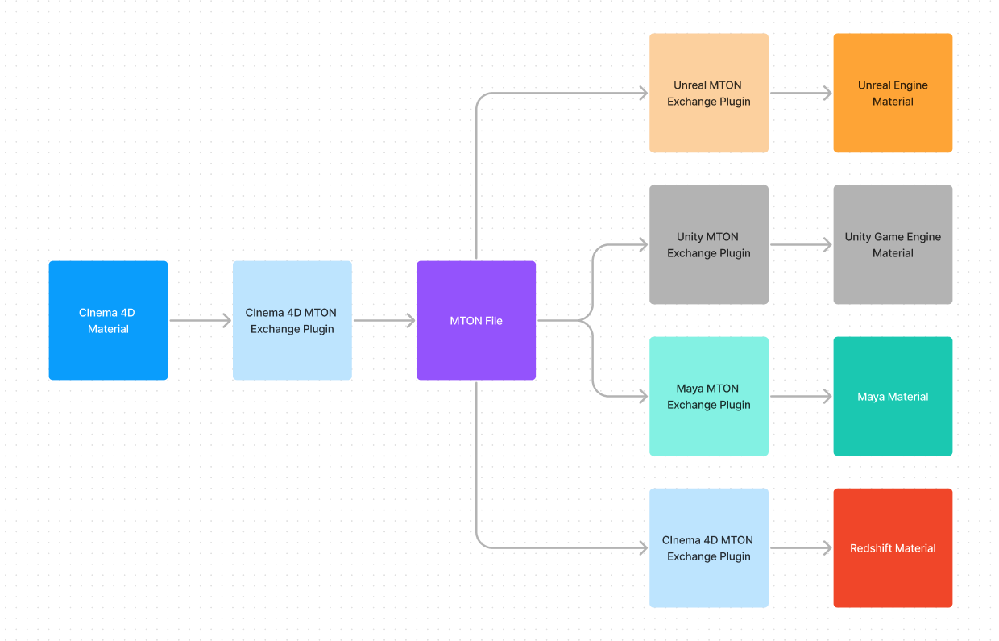

# Approach
MTON files are UTF-8 text files interpreted by exchange plugins for each compatible application.  The exchange pluginscreate native materials from the instructions contained in the .mton file.

Since MTON is based on PBR principles, and most 3D applications support PBR, focusing on PBR parameters provides an ideal starting point for cross-application compatibility.